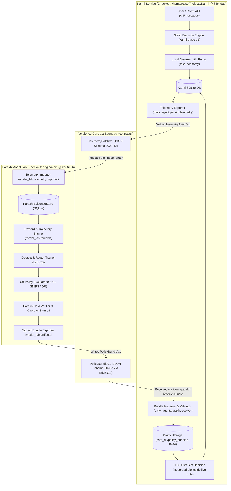

# Cross-Repository Readiness & Integration Specification

## 1. Overview & Candidate Checkouts

This document specifies the integration, verification status, and contract boundary between **Parakh** (the model evaluation and optimization laboratory) and **Karmi** (the production-facing application service).

### Candidate Audit Coordinates
- **Karmi Repository**: `/home/rosso/Projects/Karmi`
  - **Branch**: `parakh-shadow-integration`
  - **Audit SHA**: `84e49ad` (`fix(parakh): database enforces a single SHADOW policy bundle`)
  - **Base Commit**: `62072fc` (Merge pull request #21 from Kashyep/fix-parth-typo-and-test-collisions)
- **Parakh Repository**: `/home/rosso/orca/workspaces/Parakh/team-worker_primary-20260928-144842`
  - **Branch / Base**: `origin/main` (`0c66156`: `docs(contracts): reference reviewed Karmi integration commits`)

---

## 2. Readiness Status Matrix

| Component / Subsystem | Status | Evidence & Verification Level | Blocking Issues / Prerequisites |
|---|---|---|---|
| **Contract Schemas (`contracts/`)** | **VERIFIED** | `telemetry_batch_v1.schema.json` & `policy_bundle_v1.schema.json` validated stdlib-only. | None |
| **Offline Telemetry Export (Karmi)** | **VERIFIED** | Karmi `build_telemetry_batch` exports deterministic, privacy-scrubbed JSON from local runs. | None |
| **Offline Telemetry Intake (Parakh)** | **VERIFIED** | Parakh `import_batch` ingests Karmi telemetry with zero quarantine, deterministic idempotency, and candidate extraction. | None |
| **Tampered Batch Rejection** | **VERIFIED** | Mutated runs with reused `batch_id` trigger `IntegrityError`; invalid schemas trigger `TelemetryBatchError`. | None |
| **Parakh Sim Fixture (`sim/*`)** | **VERIFIED** | `policy-2026.09.27.1` verified in Parakh reference loader; real Karmi rejects unknown `sim/*` models as required. | Real Karmi registry does not register `sim/*` actions (by design). |
| **Karmi SHADOW Slot Execution** | **VERIFIED** | Test-signed `policy-karmi.1` stages and enters `SHADOW`; live route unchanged; re-export records shadow decisions. | None |
| **Negative Security Gates** | **VERIFIED** | Untrusted keys, incompatible Karmi versions, and live traffic transitions (`canary`, `production`) are refused. | None |
| **Real-Action Provider Evidence** | **BLOCKED** | Test-signed bundle is **NOT Parakh-verified**; no live model calls executed. | Requires authorized `pilot run --allow-paid` with 60-case benchmark evidence on real providers. |
| **Production Traffic Promotion** | **BLOCKED** | Karmi explicitly refuses `canary` and `production` transitions (`BundleStateError`). | Requires separate operator approval and canary deployment infrastructure. |

---

## 3. Cross-Repository Boundary Architecture



---

## 4. Contract Specifications & Guarantees

### 4.1 TelemetryBatchV1
- **File / Schema**: `contracts/telemetry_batch_v1.schema.json`
- **Producer**: `Kashyep/Karmi` (version 0.1.0)
- **Feature Schema Version**: `routing-features.v1`
- **Currency & Units**: Synthetic micro-units recorded with ISO 4217 code `XTS`. Costs are deliberately **not** USD-normalized by Parakh.
- **Privacy Enforcement**:
  - Raw prompt text, assistant responses, user notes, account IDs, and user display names are strictly excluded at Karmi's export boundary.
  - Dashed UUIDs are converted to undashed prefixed hex tokens (`run-`, `dec-`, `att-`) to eliminate false-positive Aadhaar/phone pattern matches during Parakh's intake privacy scan.
  - Parakh's intake privacy scanner (`model_lab.telemetry.privacy.scan`) audits incoming batches; any residual credentials, tokens (`sk-live-`, `Bearer`), or PII trigger immediate quarantine.
- **Idempotency & Tamper Resistance**:
  - Export window boundaries (`[start, end)`) and run contents deterministically compute `batch_id`.
  - Re-exporting an unchanged time window generates byte-identical JSON.
  - Parakh returns status `"duplicate"` with identical `import_id` when an existing batch checksum matches.
  - If a batch is submitted with an existing `batch_id` but mutated payload, Parakh rejects the import with `model_lab.errors.IntegrityError: batch_id reused with different content`.

### 4.2 PolicyBundleV1
- **File / Schema**: `contracts/policy_bundle_v1.schema.json`
- **Signature & Integrity**: Ed25519 signature in `signature.sig` covering SHA-256 digests in `checksums.json`. All files under the bundle directory must match the checksums; symlinks, extra files, or modified parameters cause immediate rejection (`BundleRejected`).
- **Storage Immutability**: Received bundles are stored in Karmi at `data_dir/policy_bundles/<version>` with write permissions revoked (`chmod 0o444`).
- **Karmi Lifecycle States**:
  - `RECEIVED`: Verified and stored; inactive.
  - `STAGED`: Re-verified against active trusted keys; candidate for shadow. Direct transition from `RECEIVED` to `SHADOW` is refused.
  - `SHADOW`: Evaluated on live requests alongside the static router; records predictions without affecting live user responses.
  - `RETIRED`: Superseded by a newer shadow bundle or explicitly retired.
  - `CANARY` / `PRODUCTION`: **Refused**. Karmi returns `BundleStateError` because live traffic mutations are not implemented in this release.
- **Single-Shadow Constraint**: SQLite table constraints ensure at most one bundle is in `SHADOW` state at any time. Moving a bundle to `SHADOW` automatically retires any existing shadow bundle.

---

## 5. Separation of Concerns: Simulated vs. Real-Action Bundles

### 5.1 Simulated Action Fixture (`sim/*`)
- **Fixture Location**: `Karmi/tests/fixtures/parakh/policy-2026.09.27.1`
- **Actions**: `sim/balanced`, `sim/cheap`, `sim/flagship`
- **Public Key**: `8588d3d16dfd2a08e691a8da48aea9925f4dea853ba036477593dcdcebbe21d5`
- **Role**: Serves as the ground-truth contract compatibility fixture exported from Parakh's synthetic flywheel.
- **Behavior**:
  - Loads, calculates probabilities, and executes shadow selection in Parakh's reference loader (`contracts/karmi_reference/loader.py`).
  - **Refused by real Karmi**: Karmi's model registry only recognizes `karmi/fake-economy` and `typesafe/system-one`. When presented to real Karmi, `receiver.verify_bundle` raises `BundleRejected: unknown models: ['sim/balanced', 'sim/cheap', 'sim/flagship']`.

### 5.2 Test-Signed Karmi-Action Bundle (`policy-karmi.1`)
- **Generator**: `Karmi/tests/parakh_helpers.py` (`make_karmi_bundle`)
- **Actions**: `karmi/fake-economy`
- **Signing Key**: Ephemeral test key (`TEST_SECRET = bytes(range(32))`, public key `TEST_PUBLIC_KEY`).
- **Role**: Exercises real Karmi's bundle admission, staging, shadow execution, and telemetry re-export.
- **Status & Policy Restriction**:
  - **NOT Parakh-Verified**: Parakh cannot certify or export a PolicyBundleV1 over Karmi's real actions (`karmi/fake-economy`, `typesafe/system-one`) without authorized 60-case benchmark evidence from `pilot run --allow-paid`.
  - **Real-Action Provider Evidence is BLOCKED**: Live provider execution without explicit authorized budget and operator sign-off raises `PilotBlockedError`.
  - This bundle is strictly for offline contract testing; it must never be presented as production-ready or Parakh-verified.

---

## 6. Targeted Test Execution Guide for Integration Owner

Once merged into the integration branch, the integration owner can execute the complete cross-repository readiness suite using the commands below.

### 6.1 Prerequisites
1. Python ≥ 3.11 environment.
2. Candidate Karmi repository at `/home/rosso/Projects/Karmi` with installed virtual environment (`/home/rosso/Projects/Karmi/.venv`).
3. Parakh workspace root on `PYTHONPATH`.

### 6.2 Test Command
Run the targeted cross-repo readiness tests from the Parakh workspace root:

```sh
# Run targeted cross-repo readiness integration suite
PYTHONPATH="/home/rosso/orca/workspaces/Parakh/team-worker_primary-20260928-144842:/home/rosso/Projects/Karmi/src" \
/home/rosso/Projects/Karmi/.venv/bin/pytest tests/test_cross_repo_readiness.py -v
```

### 6.3 Targeted Sub-Test Execution
To run specific verification flows:

```sh
# 1. Offline synthetic flow: Karmi /v1/messages -> Karmi exporter -> Parakh importer & evaluation
PYTHONPATH=".:/home/rosso/Projects/Karmi/src" \
/home/rosso/Projects/Karmi/.venv/bin/pytest tests/test_cross_repo_readiness.py -k "test_offline_synthetic_flow" -v

# 2. Reference loader sim fixture check vs real Karmi unknown action rejection
PYTHONPATH=".:/home/rosso/Projects/Karmi/src" \
/home/rosso/Projects/Karmi/.venv/bin/pytest tests/test_cross_repo_readiness.py -k "test_parakh_signed_sim_fixture" -v

# 3. Real Karmi SHADOW lifecycle, live route invariance, and shadow re-export
PYTHONPATH=".:/home/rosso/Projects/Karmi/src" \
/home/rosso/Projects/Karmi/.venv/bin/pytest tests/test_cross_repo_readiness.py -k "test_karmi_action_bundle" -v

# 4. Verification boundary gate: test-signed bundle unverified & real provider evidence blocked
PYTHONPATH=".:/home/rosso/Projects/Karmi/src" \
/home/rosso/Projects/Karmi/.venv/bin/pytest tests/test_cross_repo_readiness.py -k "test_test_signed_bundle" -v
```

### 6.4 Expected Test Results
- `4 passed` in ~1.5s.
- Zero network calls issued.
- Zero live provider API tokens accessed.
- All temporary SQLite databases and bundle directories cleaned up automatically via pytest `tmp_path`.

---

## 7. Residual Risks & Governance Controls

1. **Unintentional Live Traffic Routing**:
   - *Risk*: An operator attempts to activate a model policy directly for user traffic.
   - *Control*: Karmi code explicitly disallows transitions to `canary` or `production`, raising `BundleStateError`. Live routes remain locked to `fake-economy` / static router.
2. **Provider Cost Leakage**:
   - *Risk*: A test or benchmark accidentally contacts paid model APIs.
   - *Control*: `Settings(environment="test")` enforces `live_models_enabled=False`. Parakh's `require_dispatch_authorization` enforces `PilotBlockedError` if `allow_paid=False`.
3. **Telemetry Tampering / Collision**:
   - *Risk*: Ingestion of conflicting data under the same batch ID.
   - *Control*: Checksum matching and duplicate detection enforce idempotence; altered payloads with reused batch IDs are blocked by `IntegrityError`.
